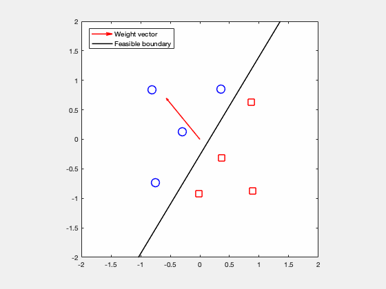
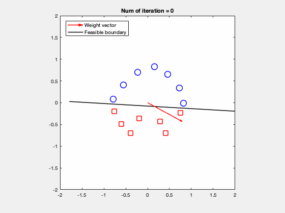
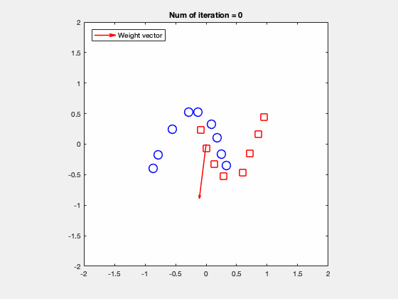

# Perceptron learning algorithm in Matlab
A Matlab demo tries to understand the perceptron learning from the geometric view. The process of learning algorithm is to maximize the angle between weight vector and feasible boundary. Hence, the optimal weights will be perpendicular to the feasible boundary.  

## Reference
This code is revised based on Geoffrey E. Hinton course in Coursera [[link]](http://www.cs.toronto.edu/~tijmen/csc321/). 

## Requirements
This code is tested by Matlab R2017a.

## Usage example
### Run the demo using dataset that exists feasible boundary.

```
load datasets/dataset1
learn_perceptron(neg_examples_nobias,pos_examples_nobias,w_init,w_gen_feas)
```
<p align="center"></p>

```
load datasets/dataset3
learn_perceptron(neg_examples_nobias,pos_examples_nobias,w_init,w_gen_feas)
```
<p align="center"></p>

### Run the demo using dataset that doesn't exist feasible boundary.

```
load datasets/dataset4
learn_perceptron(neg_examples_nobias,pos_examples_nobias,w_init,w_gen_feas)
```
<p align="center"></p>