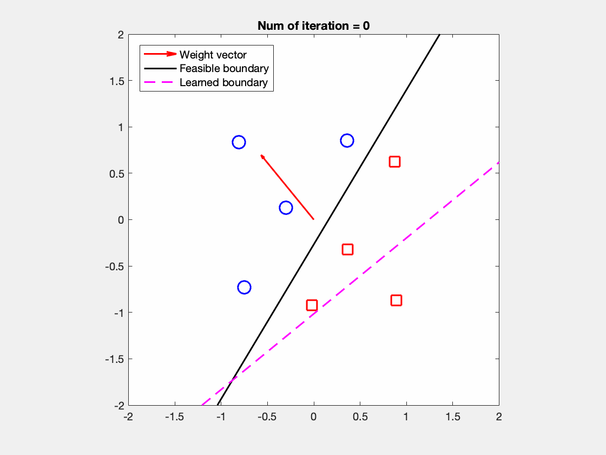
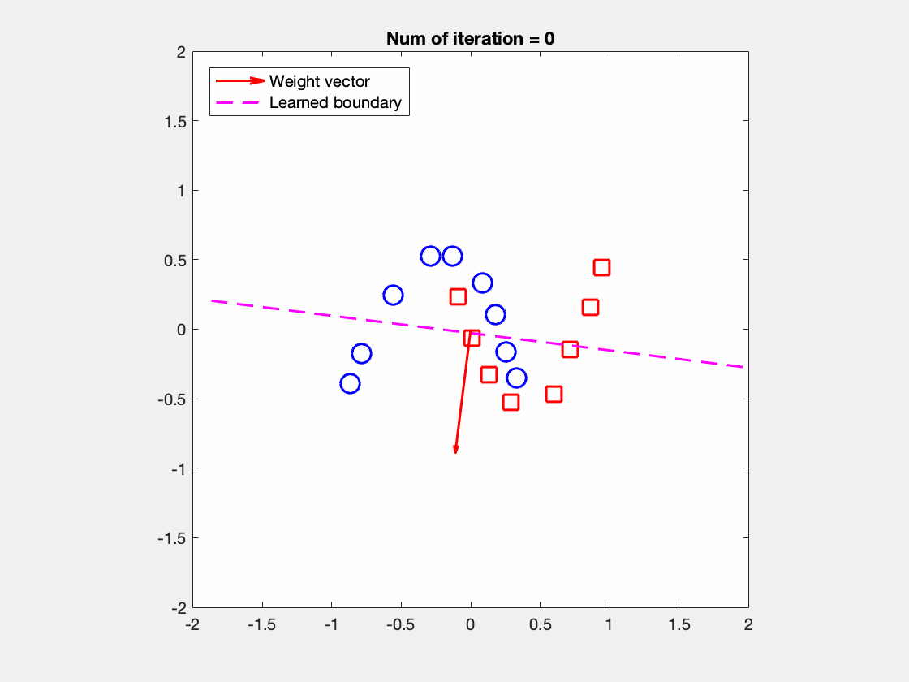

# Perceptron learning algorithm in Matlab
A Matlab demo tries to understand the perceptron learning from geometric view. The process of learning algorithm is to maximizing the angle between weight vector and feasible boundary. Hence, the optimal weights will be perpendicular to the feasible boundary.  

## Reference
This demo is revised based on Geoffrey E. Hinton course in Coursera[[link]](http://www.cs.toronto.edu/~tijmen/csc321/)

## Requirements
This code is tested by Matlab R2017a

## Usage example
####Run the demo using datasets that exists feasible boundary

```
load datasets/dataset1
learn_perceptron(neg_examples_nobias,pos_examples_nobias,w_init,w_gen_feas)
```
<div></div><br />

####Run the demo using datasets that doesn't  feasible boundary

```
load datasets/dataset4
learn_perceptron(neg_examples_nobias,pos_examples_nobias,w_init,w_gen_feas)
```
<div></div>
